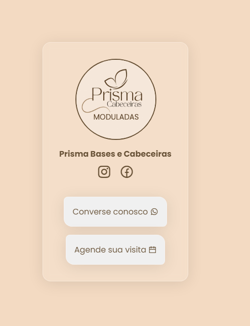

# Nome do Projeto

  

Hoje eu tive o prazer de realizar um projeto para o meu pai e a empresa dele.
É tipo um Linktree só que 100% personalizável.
  

[Acesse o projeto em produção](https://prismabasecabeceiras.vercel.app/)

## :man_mechanic: Linguagens e Ferramentas

## :triangular_flag_on_post: Contribua com o projeto

- Realize o Fork
- Faça as modificações necessárias
- Realize a Pull Request (PR)
